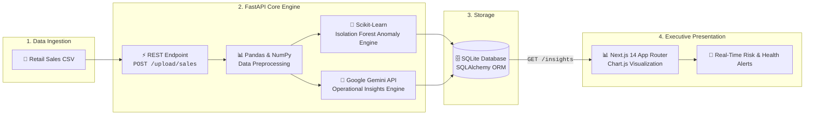

<div align="center">

    
<p align="center">
  <b>Real-time business health monitoring, ML anomaly detection, and Gemini AI-powered operational insights.</b>
</p>

<!-- TECH BADGES -->
<p align="center">
  
  
  
  
  
  
</p>

<!-- STATUS PILLS -->
<p align="center">
  
  
  
  
  
</p>

</div>

---

### 📖 Overview

**OpSense** is an enterprise-grade AI Operational Intelligence platform engineered specifically for modern retail workflows. It automates operational risk mitigation by pairing unsupervised machine learning (`Isolation Forest`) with large language models (`Google Gemini API`). 

Retail managers upload raw sales CSV files, and OpSense instantly profiles operational anomalies, surfaces root causes, generates natural-language remediation actions, and tracks real-time business health scores on a dynamic Next.js 14 dashboard.

---

### 🧠 System Architecture & Workflow



---

### ✨ Key Platform Features

| Feature | Description | Architecture Highlights |
|:---|:---|:---|
| 🏥 **Business Health Monitoring** | Calculates dynamic health scores across store operations and inventory velocity. | Real-time scoring algorithms based on multi-variable risk metrics. |
| 🤖 **AI Anomaly Detection** | Surfaces irregularities in revenue, transaction counts, and stock movements. | Unsupervised `Isolation Forest` with customizable contamination thresholds. |
| 💡 **Gemini Operational Insights** | Translates statistical outliers into executive summaries and action items. | Few-shot prompt engineering over structured JSON sales summaries. |
| 📁 **Zero-Friction Ingestion** | Multipart form file upload for raw retail sales CSV data. | Streaming multipart upload, schema validation, and missing-data imputation. |
| 📊 **Modern Analytics UI** | Executive dashboard with interactive charts, metrics, and risk monitors. | Next.js 14 App Router, Tailwind CSS, Lucide icons, and Chart.js. |
| 🛡️ **Risk Tracking & Alerts** | Classifies anomalies into Low, Medium, High, and Critical alert levels. | Automated alert lifecycle tracking with timestamped audit trails. |

---

### 🛠️ Technology Stack

<table width="100%">
  <tr>
    <td width="50%" valign="top">
      <h4>⚡ Backend Ecosystem</h4>
      <ul>
        <li><b>Framework:</b> <a href="https://fastapi.tiangolo.com/">FastAPI</a> (Python)</li>
        <li><b>ORM & Database:</b> SQLAlchemy with SQLite (PostgreSQL compatible)</li>
        <li><b>Machine Learning:</b> scikit-learn (<code>Isolation Forest</code>)</li>
        <li><b>Generative AI:</b> Google Gemini API (Insight Generation)</li>
        <li><b>Data Processing:</b> Pandas, NumPy</li>
        <li><b>Server:</b> Uvicorn ASGI Server</li>
      </ul>
    </td>
    <td width="50%" valign="top">
      <h4>🎨 Frontend Ecosystem</h4>
      <ul>
        <li><b>Framework:</b> <a href="https://nextjs.org/">Next.js 14</a> (App Router)</li>
        <li><b>Language:</b> TypeScript (Strict mode)</li>
        <li><b>Styling:</b> Tailwind CSS (Dark & Light tokens)</li>
        <li><b>Visualization:</b> Chart.js with <code>react-chartjs-2</code></li>
        <li><b>Iconography:</b> Lucide React</li>
        <li><b>State Management:</b> React Hooks & Context</li>
      </ul>
    </td>
  </tr>
</table>

---

### 🚀 Quick Start Guide

#### Prerequisites
- **Python:** `3.8+` installed
- **Node.js:** `18.0+` & `npm` or `yarn` installed
- **API Key:** Active [Google Gemini API Key](https://aistudio.google.com/)

---

#### 1️⃣ Backend Setup

```bash
# 1. Clone the repository and navigate to backend
cd backend

# 2. Initialize and activate Python virtual environment
python -m venv venv

# On Linux / macOS:
source venv/bin/activate
# On Windows (PowerShell):
venv\Scripts\Activate.ps1

# 3. Install production dependencies
pip install -r requirements.txt

# 4. Configure environment variables
cp .env.example .env

# 5. Open .env and insert your Gemini API Key:
# GEMINI_API_KEY="AIzaSy..."

# 6. Start the FastAPI development server
uvicorn app.main:app --reload --port 8000
```

> **Backend Server:** `http://localhost:8000`  
> **Interactive Swagger Docs:** `http://localhost:8000/docs`  
> **ReDoc Alternative:** `http://localhost:8000/redoc`

---

#### 2️⃣ Frontend Setup

```bash
# 1. Open a new terminal and navigate to frontend
cd frontend

# 2. Install dependencies
npm install

# 3. Start the Next.js development server
npm run dev
```

> **Client Application:** `http://localhost:3000`

---

### 🔑 REST API Reference

#### 1. System Health Check
`GET /`
```http
GET / HTTP/1.1
Host: localhost:8000
```
```json
{
  "message": "Opsense API running successfully"
}
```

---

#### 2. Upload & Analyze Retail Data
`POST /upload/sales`
```http
POST /upload/sales HTTP/1.1
Host: localhost:8000
Content-Type: multipart/form-data; boundary=----WebKitFormBoundary

------WebKitFormBoundary
Content-Disposition: form-data; name="file"; filename="retail_sales_q1.csv"
Content-Type: text/csv

[Binary / CSV Content]
------WebKitFormBoundary--
```

**Response (`200 OK`):**
```json
{
  "message": "File processed and insights saved",
  "records_processed": 1420,
  "anomalies_detected": 18,
  "insights": [
    {
      "severity": "HIGH",
      "category": "Revenue Drop",
      "message": "Unusual 42% revenue decline detected in Store #104 during weekend peak hours.",
      "recommended_action": "Audit point-of-sale terminal sync and cross-reference inventory logs.",
      "timestamp": "2026-09-06T11:45:00Z"
    }
  ]
}
```

---

#### 3. Fetch Operational Insights & Alerts
`GET /insights`
```http
GET /insights HTTP/1.1
Host: localhost:8000
Accept: application/json
```

**Response (`200 OK`):**
```json
[
  {
    "id": 1,
    "severity": "CRITICAL",
    "message": "Supply chain stockout risk identified for SKU-8821 across 3 regional warehouses.",
    "status": "OPEN",
    "timestamp": "2026-09-06T10:15:00Z"
  }
]
```

---

### 📁 Project Architecture

```console
opSense/
├── 📂 backend/
│   ├── 📂 app/
│   │   ├── 📂 database/          # SQLite engine & session management
│   │   ├── 📂 ml/                # Scikit-learn Isolation Forest pipeline
│   │   ├── 📂 models/            # SQLAlchemy declarative database models
│   │   ├── 📂 routes/            # FastAPI API routers & request handlers
│   │   ├── 📂 services/          # Gemini API client & business logic
│   │   └── 📄 main.py            # FastAPI ASGI entrypoint & middleware
│   ├── 📂 tests/                 # Automated pytest test suites
│   ├── 📄 requirements.txt       # Production dependencies
│   └── 📄 requirements-dev.txt   # Development & testing tooling
├── 📂 frontend/
│   ├── 📂 app/                   # Next.js 14 App Router layout & pages
│   ├── 📂 components/            # Reusable UI widgets & Chart.js cards
│   ├── 📂 lib/                   # API client utilities & helper functions
│   └── 📂 public/                # Static brand assets & SVG icons
├── 📄 .gitignore                 # Git ignore rules
└── 📄 README.md                  # Project documentation
```

---

### 🧪 Testing & Code Quality

```bash
# Navigate to backend
cd backend

# Install development & test dependencies
pip install -r requirements-dev.txt

# Execute automated test suite with pytest
python -m pytest tests/ -v

# Run Python code formatting and linting
black .
flake8
```

```bash
# Build & validate production bundle for frontend
cd frontend
npm run build
npm run start
```

---

### 🔒 Security & Best Practices

> [!IMPORTANT]
> **Environment Variables:** Never commit `.env` files with secret keys to version control. Always copy from `.env.example`.

> [!TIP]
> **Production Scaling:** In high-concurrency environments, migrate from SQLite to PostgreSQL and configure connection pooling.

> [!NOTE]
> **CORS Security:** Ensure allowed origins in `app/main.py` are strictly restricted to your production frontend domain in production deployments.

---

### 🗺️ Future Engineering Roadmap

- [ ] **Authentication & RBAC:** JWT bearer tokens with role-based dashboard access control
- [ ] **Database Migration:** PostgreSQL migration with automated Alembic versioning
- [ ] **Asynchronous Workers:** Background file processing with Celery & Redis message broker
- [ ] **Containerization:** Production multi-stage `Dockerfile` and `docker-compose.yml`
- [ ] **Streaming Telemetry:** Real-time WebSocket streaming for live transaction alerts
- [ ] **Report Generation:** Automated PDF & Excel executive report exports
- [ ] **Advanced Forecasting:** Time-series demand forecasting with Prophet & NeuralProphet

---

### 📄 License & Attribution

This project is licensed under the **MIT License** — free for educational, demonstration, and commercial extension.

<div align="center">

---

<b>Built with ❤️ for AI Operational Excellence • OpSense Platform</b>

</div>
